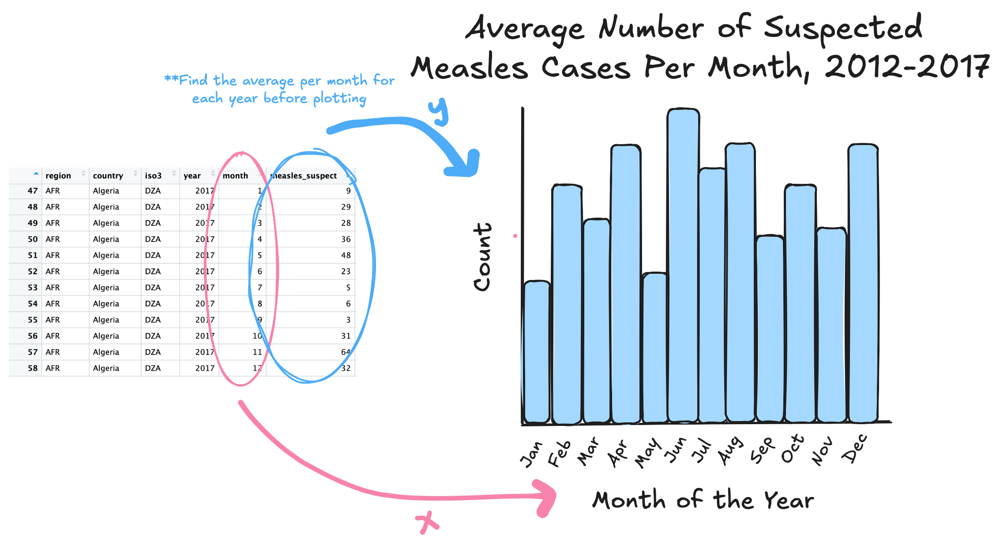
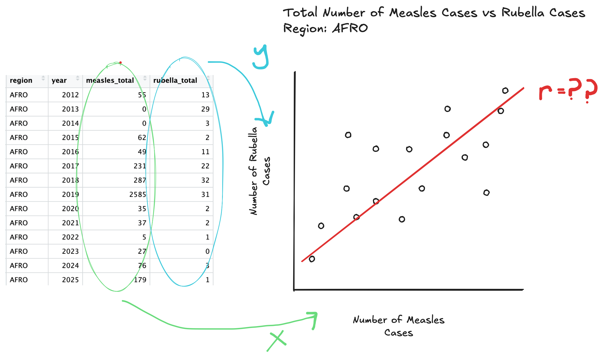

# Project Checkpoint 1

## Context
This data gives information about measles and rubella for different countries in the world, including the year-- and month for one of the datasets--, how many cases were suspected, confirmed, linked to other breakouts, etc.

## Cleaning
Variable names were cleaned up and some data types were fixed.

## Research Questions Addresses Using the Data
1. Do certain months of the year tend to have a higher amount of suspected measles cases?
2. Are the number of measles cases per year correlated to the number of rubella cases per year, for a given country

## Research Questions Addressed Using Supplemental Data
1. Does the geography of a region impact the number of suspected measles cases?
2. Has changes in the climates of regions impacted the number of suspected measles cases from year to year>

## Data Visualizations

